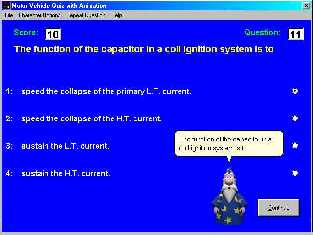



## MvQuiz with Animation

### Description

This program is a motor vehicle quiz using the Microsoft Agents. Its a series of motor vehicle questions for the students to learn. But the questions and answers can be adapted to anything you wish. You can also choose any Text to Speech engine installed on your computer.

If you like and use this code please give it a vote.
 
### More Info
 
It uses Microsoft Agents which can be downloaded from:

http://www.microsoft.com/msagent/

If you are using Windows 95\98 then you need to download and install msagent.exe.

MS Characters - merlin.exe, genie,exe, peedy.exe and robby.exe can also be downloaded from the same site.

If you are using Windows 2000\ME\XP then they may already been installed in [Windows Folder]\Msagents\Chars.

To make the program run you only need to download and install msagent.exe and merlin.exe. The program checks to see if the other agents are

installed before loading.

One of the TTS3000 text-to-speech engines.

Then download the Microsoft SPIA 4.0a runtime binaries (824k)

from http://www.microsoft.com/products/msagent/downloads.htm#sapi

             |
---                |---
**Submitted On**   |2002-11-17 19:41:50
**By**             |[Keith Stanier](https://github.com/Planet-Source-Code/PSCIndex/blob/master/ByAuthor/keith-stanier.md)
**Level**          |Intermediate
**User Rating**    |5.0 (25 globes from 5 users)
**Compatibility**  |VB 5\.0, VB 6\.0
**Category**       |[Sound/MP3](https://github.com/Planet-Source-Code/PSCIndex/blob/master/ByCategory/sound-mp3__1-45.md)
**World**          |[Visual Basic](https://github.com/Planet-Source-Code/PSCIndex/blob/master/ByWorld/visual-basic.md)
**Archive File**   |[MvQuiz\_wit14990711172002\.zip](https://github.com/Planet-Source-Code/keith-stanier-mvquiz-with-animation__1-40194/archive/master.zip)

